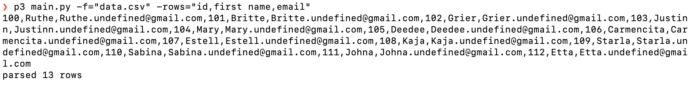

### Parsing CSV with python

Story: At Tecognize Training, we have a lot of registration and we need to invite them to our google drive and slack via email. Every student's information was on a CSV file. We had more than 280 students in this case. 

I didn't want to copy and paste 280 student's email twice. In google or slack, to invite users you can paste a comma separated emails string (eg "john@gmail.com, doe@gmail.com") and the platform will autmatically separate it. Hence, this script was born.

### Requirements
- python3 

How to run, this script takes few params, 
```
python3 main.py -f="data.csv" -columns="id,first name,email"
```

### Params
- `-f` is for file, give the location of the file. Can include path. So, `-f="data.csv"` and `-f="../../Downloads/data.csv"` both are fine. Must include .csv extension in the param.
- `-columns` are the list of columns you want to parse. eg: `-columns="id,email"`. It will read `id` and `email` column of every row.
- `-sep` is for separator. By default it is a comma (`,`). But you can give it anything. 

The output result will be 1 single string. And will also print how many rows it had parsed.



A demo csv has been added.

~/.peace
